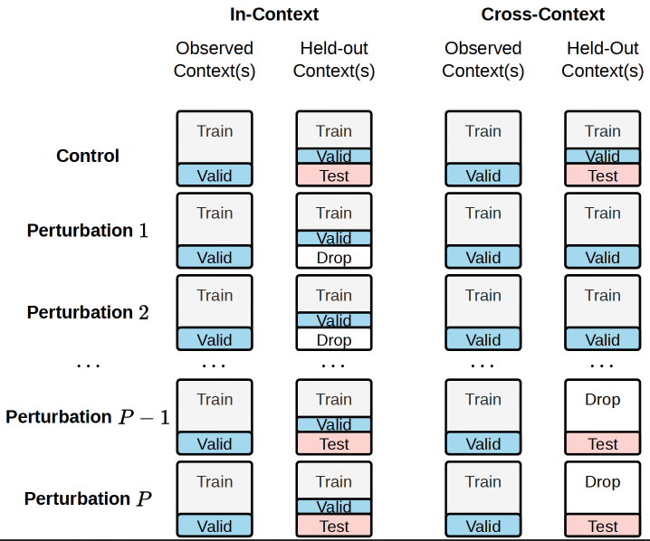

# Mechanisms Matter: Transportability of Cellular Perturbation Effects

[](https://github.com/microsoft/mechanisms_matter/actions/workflows/code-analysis.yml)

This repository contains the code to replicate experiments in our paper [Mechanisms Matter: Transportability of Cellular Perturbation Effects](https://www.biorxiv.org/content/10.64898/2026.05.08.723625v2), accepted at the 2026 Workshop on Generative and Agentic AI for Biology (ICML 2026). The project studies when perturbation effects can be transported across biological contexts using causal simulations, real Perturb-seq datasets, simple baselines, deep learning models, and diversity-aware evaluation metrics.

To cite the paper:

```bibtex
@inproceedings{
  qi2026mechanisms,
  title={Mechanisms Matter: Transportability of Cellular Perturbation Effects},
  author={Shi-ang Qi and Paidamoyo Chapfuwa},
  booktitle={2026 Workshop on Generative and Agentic AI for Biology (ICML 2026)},
  year={2026},
  doi={10.64898/2026.05.08.723625},
  url={https://www.biorxiv.org/content/10.64898/2026.05.08.723625v2}
}
```

- **Keywords**: Cellular Perturbation, Transportability, Causal Inference
- **License**: MIT

## Transportability Framework


## Data

### CausalDGP

[CausalDGP](transportability/src/perturbations/data/dgp/causalDGP.py) is the proposed data-generating process for realistic *semi-synthetic* single-cell perturbation data. It models *context-specific* gene expression as a SDE,

$$
d X(t) = (A_C X(t) + B_C + \Gamma_q) dt + \sigma d W (t)
$$

where $C$ is the cellular context, $A_C$ is a sparse gene-regulatory network, $B_C$ is the baseline state, $\Gamma_q$ is the perturbation effect, and $q$ is the perturbation. The simulator generates two cellular contexts and can vary $A$, $B$, both, or neither through `--diversity_type` to test transportability under controlled causal changes. See [Example Runs](#example-runs) to generate and evaluate CausalDGP datasets.

### Real Datasets

The following Perturb-seq datasets are used for real-data experiments:

| Dataset | Cell Lines | Source |
|---------|-----------|--------|
| Norman19 | K562 | [Norman et al. 2019](https://pmc.ncbi.nlm.nih.gov/articles/PMC6746554/) |
| Replogle22 | K562, RPE1 | [Replogle et al. 2022](https://www.sciencedirect.com/science/article/pii/S0092867422005979) |
| Nadig25 | Jurkat, HepG2 | [Nadig et al. 2025](https://www.nature.com/articles/s41588-025-02169-3) |
| Zhu25 | Primary human CD4+ T cells across 4 donors | [Zhu et al. 2025](https://doi.org/10.64898/2025.12.23.696273) |

See the per-dataset README files under [`transportability/src/perturbations/data/`](transportability/src/perturbations/data/) for download and preprocessing instructions.

### Simulator Validation

[The simulator-validation analysis](transportability/src/perturbations/analyses/simulator_validation/generate_statistics.py) compares real and synthetic data using gene-wise and cell-wise marginal statistics, gene-pair correlations, and [TRADE](transportability/src/perturbations/metrics/perturbation_effect/trade.py) ([Nadig et al. 2025](https://www.nature.com/articles/s41588-025-02169-3)) perturbation-effect statistics.

## Context-Aware Splitting



The [`ContextSplitter`](transportability/src/perturbations/analyses/context.py) partitions cells into train, validation, and test sets under two strategies that share a single seeded plan per trial for quantifying the cross-context generalization gap.

## Models

| Model | Source |
|-------|--------|
| Control mean | Included |
| Pert. mean | Included |
| linearPCA | Included |
| scVI | Included |
| CPA | [CPA](https://github.com/theislab/cpa) |
| GEARS | [GEARS](https://github.com/snap-stanford/GEARS) |
| STATE | [STATE](https://github.com/ArcInstitute/state)  |
| STATE (Geneformer) | [STATE](https://github.com/ArcInstitute/state) + [Geneformer](https://huggingface.co/ctheodoris/Geneformer) |
| scLDM | [scLDM](https://github.com/czi-ai/scldm) |

STATE (Geneformer) uses [Geneformer](https://huggingface.co/ctheodoris/Geneformer) cell embeddings as the basal cell state. See [`geneformer_env/`](transportability/geneformer_env/) for extraction setup.

## Metrics

The `perturbations` package provides evaluation metrics for perturbation models across three categories: perturbation effect, reconstruction, and gene selection. The [proposed Vendi score](transportability/src/perturbations/metrics/reconstruction/vendi_score.py) is used in two forms: a cell-level Vendi score for distributional reconstruction and a pseudobulk Vendi score for perturbation effects.

Four analyses validate the Vendi score:

- [Effective-rank benchmark](transportability/src/perturbations/analyses/vendi_score/vendi_effective_rank.py): benchmarks cell-level and pseudobulk Vendi against the direct pseudobulk covariance effective rank across simulated datasets.
- [Null-signal validation](transportability/src/perturbations/analyses/vendi_score/vendi_null_signal.py): tests metric behavior from the population null through increasing perturbation-effect strength and under pseudobulk sampling noise.
- [Sample-size bias analysis](transportability/src/perturbations/analyses/vendi_score/vendi_sample_size_bias.py): stress-tests pseudobulk Vendi under heterogeneous perturbation sample sizes and compares large-pool and sampling-matched oracle calibration across cell counts.
- [Robustness analysis](transportability/src/perturbations/analyses/vendi_score/vendi_robustness.py): evaluates Vendi and effective-rank sensitivity to injected Gaussian noise.

The [`run_vendi`](transportability/src/perturbations/analyses/vendi_score/run_vendi.py) script computes dataset-level Vendi scores and split-half PDS-L1 for real and synthetic datasets.

## Prerequisites

- [Python 3.11](https://www.python.org/) is the reference interpreter. The main
  manifests support Python 3.10–3.12; Geneformer supports 3.10–3.11.
- [uv 0.11.8](https://docs.astral.sh/uv/) for dependency management

Install the `perturbations` package and its dependencies:

```bash
cd transportability
uv --no-config sync --locked --python 3.11
```

The checked-in `uv.lock` pins direct and transitive dependencies. `--locked`
rejects a stale lock instead of changing the environment. See
[environment setup](docs/environments.md) for the notebook and Geneformer
environments, hardware requirements, validation, and Alliance HPC setup. On HPC,
install dependencies and run Python inside a Slurm allocation, with environments,
caches, data, and outputs on scratch storage.

The CPA, GEARS, STATE, and scLDM backend wrappers are currently excluded from Git.
Installing their upstream dependencies does not restore these local wrappers.
The examples below select included baselines; experiments using the excluded
wrappers require those implementations to be supplied separately.

## Example Runs

The analysis modules use paths relative to the package source directory. After setup, run the examples from that directory:

```bash
cd src/perturbations
```

Run a self-contained synthetic quickstart on CPU:

```bash
uv --no-config run --locked python -m perturbations.analyses.synthetic_simulations.random_sweep \
  --demo \
  --n_trials 2 \
  --dataset causalDGP \
  --split_strategy in-context \
  --diversity_type A \
  --models Control Average linearPCA \
  --output_dir results/synthetic_quickstart
```

The demo generates illustrative parameter arrays in memory and uses 64 genes,
eight perturbations, 64 control cells, and 32 cells per perturbation in each
context. It requires no datasets, fitted CSVs, model downloads, or GPU. It runs
the simulator, context splitting, baseline predictions, and evaluation, and writes
a `results_*.csv` under `results/synthetic_quickstart/`. Successful runs report
`Success: 2/2 trials`, `Failed: 0/2 trials`, and `status=success` in the CSV.
Use `--dataset directDGP` to exercise the direct simulator, or
`--split_strategy cross-context` with `causalDGP` to exercise transportability.
On Alliance HPC, run inside Slurm and set `--output_dir` to a directory on
`$SCRATCH`. To run outside the checkout, use the installed environment's
`python -m perturbations.analyses.synthetic_simulations.random_sweep`, or pass
`--project <repository-path>/transportability` to `uv run`.

For paper-scale sweeps, generate fitted inputs from Norman19 first. From
`transportability/src/perturbations/`, run these steps. On Alliance HPC, use a
compute allocation and a working directory on `$SCRATCH` with the same `data/`
and `results/` layout. Outside the checkout, also pass
`--project <repository-path>/transportability` to both commands:

```bash
uv --no-config run --locked python -m perturbations.data.norman19.get_data
uv --no-config run --locked python -m perturbations.analyses.synthetic_simulations.parameter_estimation
```

Preprocessing creates `data/norman19/norman19_processed.h5ad` and
`data/norman19/norman19_genes.csv.gz`. Parameter estimation creates
`control_fitted_params.csv`, `perturbed_fitted_params.csv`, and
`all_fitted_params.csv` under `results/synthetic_simulations/parameter_estimation/`.
These generated files are ignored by Git. Run `random_sweep` without `--demo`
from the same working directory to use the fitted parameters and the paper-scale
sampling ranges. The demo's illustrative inputs are for checking the pipeline;
paper experiments use the fitted inputs.

Run real-data experiments:

```bash
uv run --locked python -m perturbations.analyses.real_experiments.run \
  --dataset_name norman19 \
  --dataset_path data/norman19/norman19_processed.h5ad \
  --n_trials 10 \
  --model linearPCA

uv run --locked python -m perturbations.analyses.real_experiments.run \
  --dataset_name replogle22 \
  --dataset_variant RPE1 \
  --split_strategy cross-context \
  --n_trials 10 \
  --model linearPCA
```

For Replogle22, run one subset per job with `--dataset_variant RPE1`, `Jurkat`, or `HepG2`.

## Repository Layout

The main package is under `transportability/src/perturbations/`:

- `data/`: dataset download, preprocessing, and synthetic data generation
- `models/`: model wrappers and baselines
- `metrics/`: reconstruction, perturbation-effect, gene-selection, PDS, and diversity metrics
- `analyses/`: experiment runners and plotting scripts
- `results/`: generated experiment outputs

## Direct intended uses

This code is shared for research purposes to reproduce and extend the experiments in the paper. It is not intended for clinical use.

## Out-of-scope uses

This is a research codebase and should not be used in any clinical or production setting.

## Risks and limitations

Transportability conclusions are conditioned on the causal assumptions and datasets described in the paper. Results may not generalise to cell types, perturbations, or experimental platforms outside the evaluated conditions.

## License and Usage Notices

The code in this repository is provided for research use only. It is not intended for use in clinical decision-making or for any other clinical use, and performance for clinical use has not been established. You bear sole responsibility for any use of this code, including incorporation into any product intended for clinical use.

## Contributing

This project welcomes contributions and suggestions. Most contributions require you to agree to a Contributor License Agreement (CLA) declaring that you have the right to, and actually do, grant us the rights to use your contribution. For details, visit https://cla.opensource.microsoft.com.

This project has adopted the [Microsoft Open Source Code of Conduct](https://opensource.microsoft.com/codeofconduct/). For more information see the [Code of Conduct FAQ](https://opensource.microsoft.com/codeofconduct/faq/).

## Trademarks

This project may contain trademarks or logos for projects, products, or services. Authorized use of Microsoft trademarks or logos is subject to and must follow [Microsoft's Trademark & Brand Guidelines](https://www.microsoft.com/en-us/legal/intellectualproperty/trademarks/usage/general). Use of Microsoft trademarks or logos in modified versions of this project must not cause confusion or imply Microsoft sponsorship. Any use of third-party trademarks or logos are subject to those third-party's policies.
