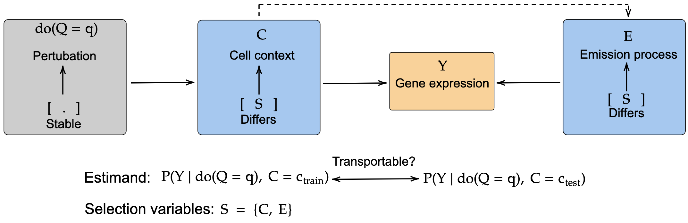

# Mechanisms Matter: Transportability of Cellular Perturbation Effects

[](https://github.com/microsoft/mechanisms_matter/actions/workflows/code-analysis.yml)

This repository contains the code accompanying our paper [Mechanisms Matter: Transportability of Cellular Perturbation Effects](https://www.biorxiv.org/content/10.64898/2026.05.08.723625v2) accepted at the 2026 Workshop on Generative and Agentic AI for Biology (ICML 2026):

```bibtex
@inproceedings{
  qi2026mechanisms,
  title={Mechanisms Matter: Transportability of Cellular Perturbation Effects},
  author={Shi-ang Qi and Paidamoyo Chapfuwa},
  booktitle={2026 Workshop on Generative and Agentic AI for Biology (ICML 2026)},
  year={2026},
  doi={10.64898/2026.05.08.723625},
  url={https://www.biorxiv.org/content/10.64898/2026.05.08.723625v2}
}
```

- **Keywords**: Cellular Perturbation, Transportability, Causal Inference
- **License**: MIT

## Model



## Prerequisites

- [Python ≥ 3.10](https://www.python.org/)
- [uv](https://docs.astral.sh/uv/) for dependency management

Install the `perturbations` package and its dependencies:

```
cd transportability
uv sync
```

## Metrics

The `perturbations` package provides evaluation metrics for perturbation models across three categories: perturbation effect, reconstruction, and gene selection. The [proposed Vendi score](transportability/src/perturbations/metrics/reconstruction/vendi_score.py) is used in two forms: a cell-level Vendi score for distributional reconstruction and a pseudobulk Vendi score for perturbation effects.

## Direct intended uses

This code is shared for research purposes to reproduce and extend the experiments in the paper. It is not intended for clinical use.

## Out-of-scope uses

This is a research codebase and should not be used in any clinical or production setting.

## Risks and limitations

Transportability conclusions are conditioned on the causal assumptions and datasets described in the paper. Results may not generalise to cell types, perturbations, or experimental platforms outside the evaluated conditions.

## License and Usage Notices

The code in this repository is provided for research use only. It is not intended for use in clinical decision-making or for any other clinical use, and performance for clinical use has not been established. You bear sole responsibility for any use of this code, including incorporation into any product intended for clinical use.

## Contributing

This project welcomes contributions and suggestions. Most contributions require you to agree to a Contributor License Agreement (CLA) declaring that you have the right to, and actually do, grant us the rights to use your contribution. For details, visit https://cla.opensource.microsoft.com.

This project has adopted the [Microsoft Open Source Code of Conduct](https://opensource.microsoft.com/codeofconduct/). For more information see the [Code of Conduct FAQ](https://opensource.microsoft.com/codeofconduct/faq/).

## Trademarks

This project may contain trademarks or logos for projects, products, or services. Authorized use of Microsoft trademarks or logos is subject to and must follow [Microsoft's Trademark & Brand Guidelines](https://www.microsoft.com/en-us/legal/intellectualproperty/trademarks/usage/general). Use of Microsoft trademarks or logos in modified versions of this project must not cause confusion or imply Microsoft sponsorship. Any use of third-party trademarks or logos are subject to those third-party's policies.
